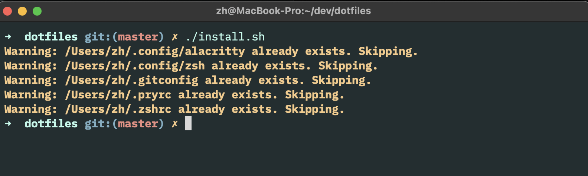

## Preview


## Requirements
- git
- zsh
- oh-my-zsh
- neovim
- homebrew
- alacritty

## Configuration
Check .config/zsh/01-initializers.zsh
Check .config/zsh/03-user-export.zsh
Check .gitconfig

They need to be updated for your personal needs

## Installation
```sh
# install configuration files
# they will be installed in ~/.config/ and symlinked
./install.sh

# install brew packages
xargs brew install < brew_packages.txt
```

## Languages
  * Ruby

    - [Rbenv](https://github.com/rbenv/rbenv)

    `rbenv install 3.3.7`

### Utilities
  * [rg](https://github.com/BurntSushi/ripgrep)

    ripgrep is a line-oriented search tool that recursively searches the current directory for a regex pattern.
    **Usage**
    ```
    ls / | rg 'myname'
    ```

  * [Zsh](https://www.zsh.org)

    Make your terminal fun again

    **Quick install**
    ```
    brew install zsh
    # make default shell
    sudo -s 'echo /usr/local/bin/zsh >> /etc/shells' && chsh -s /usr/local/bin/zsh
    ```

  * [Oh-my-zsh](https://github.com/robbyrussell/oh-my-zsh)

    Many useful packages, browse /plugins

  * [Diff-so-fancy](https://github.com/so-fancy/diff-so-fancy)

    Better git diff with syntax highlight

  * [Bat](https://github.com/sharkdp/bat)

    Better cat command with syntax highlight

  * [Alacritty](https://alacritty.org/)

    Replacement for default terminal

  * [Homebrew](https://github.com/Homebrew/install)

  * [nvim](https://github.com/neovim/neovim/blob/master/INSTALL.md#install-from-package)

    `brew install nvim`

## Troubleshooting

  * zsh-syntax-highlightning

    If occurs `plugin zsh-syntax-highlighting not found` run the following.

    ```
    git clone https://github.com/zsh-users/zsh-autosuggestions ~/.oh-my-zsh/custom/plugins/zsh-autosuggestions
    git clone https://github.com/zsh-users/zsh-syntax-highlighting.git ~/.oh-my-zsh/custom/plugins/zsh-syntax-highlighting
    ```
